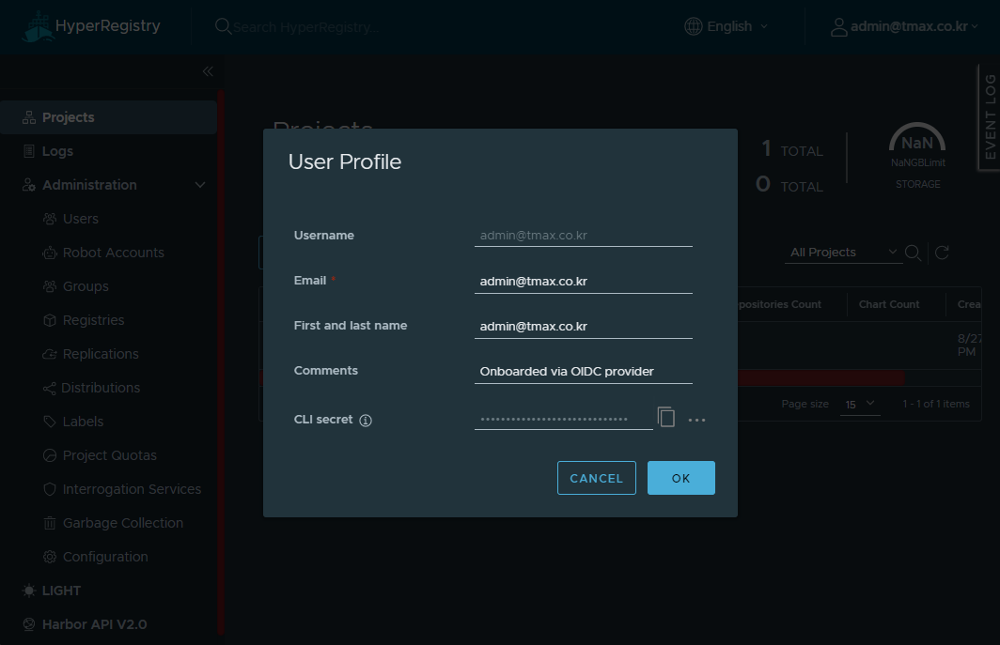

# HyperAuth OIDC 연동

> **OIDC 레지스트리 로그인**: OIDC를 연동한 경우, 이미지 Push & Pull을 위한 레지스트리 계정은 OIDC 계정이 아니라,
HyperRegistry가 발급한 계정을 사용해야한다. 해당 정보는 웹 콘솔에 OIDC 로그인 한 후, 오른쪽 상단의 사용자 프로필에서 확인할 수 있다. (Username, CLI Secret) 



## 1. HyperAuth 설정
    
1. HyperAuth에 접속
   
2. Hypercloud가 클라이언트로 등록된 Realm 선택 

3. 클라이언트 스코프 생성

   1. Client Scopes > Create
   2. 이름 입력 후 Save
   3. Mappers 탭에서 Create
   4. 다음의 내용으로 생성
      - Name: group
      - Mapper Type: Group Membership
      - Token Claim Name: **group**
      - Add to ID token: On
      - Add to access token: On
      - Add to userinfo: On

4. 클라이언트 생성

   1. Clients > Create
   2. Client ID 입력(2.4의 [clientID]), Client Protocol = openid-connect 선택 
   3. Save 클릭

5. 클라이언트 설정

   1. Access Type: confidential 선택
   2. Valid Redirect URIs 입력 
      ```text
      https://<hyperregistry_domain>/c/oidc/callback  (2.3 화면에서 save 버튼 위에 나타난 URL)
      ```
   3. (생성된) Credentials 탭에서 Secret 값 복사 (2.4의 [secret])
   4. Client Scopes > Default Client Scopes에서 3.2에서 생성한 이름 클릭 후 Add selected 클릭 

6. 그룹 생성

   1. Groups > New
   2. 그룹명 입력 후 Save

7. 사용자 생성 및 생성한 그룹에 추가

   1. Username, Email, First Name, Last Name 입력 
   2. Email Verfieid On 선택 후 Save
   3. Createndtials 탭에서 Password, Password Confirmation 입력
   4. Temporary Off 선택 후 Set Password
   5. Groups > Available Groups에서 6.에서 생성한 그룹 선택 후 Join


## 2. HyperRegistry에 설정하기

1. HyperRegistry 접속 및 관리자 로그인(admin/ admin)
   
2. (LNB) Administration > Configuration 클릭
   
3. Auth Mode: OIDC 선택
   
4. 다음 설정값 입력

- OIDC Endpoint: (ex: https://hyperauth.org/auth/realms/[realm] )
- OIDC Client ID: [clientID]
- OIDC Client Secret: [secret]
- Group Claim Name: **HyperAuth에서_생성한_group_mapper명(group)**
- OIDC Admin Group: **HyperAuth에서_생성한_그룹명**
- OIDC Scope: openid
- Automatic onboarding 체크
- Username Claim: name

5. Test OIDC SERVER 클릭하여 연결 여부 확인 후 Save
